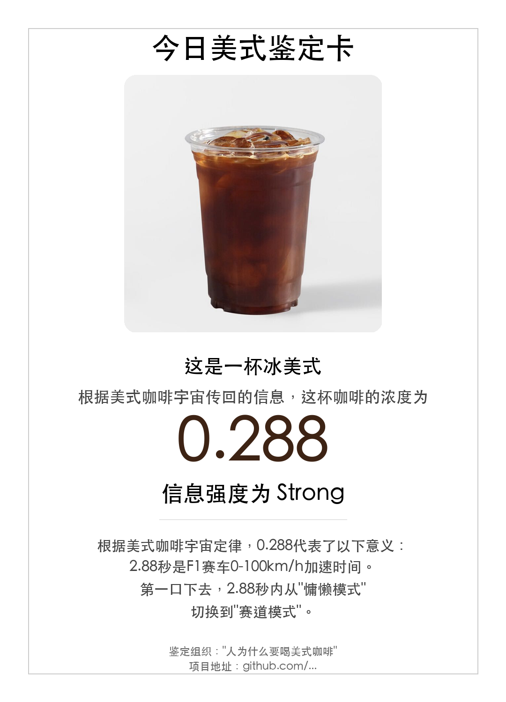

<p align="center">
  
</p>

<h1 align="center">☕ Americano Universe</h1>

<p align="center">
  <b>Upload a coffee photo → AI identifies concentration → Generate a certificate card</b>
</p>

<p align="center">
  <a href="#english">English</a> | <a href="#中文">中文</a>
</p>

<p align="center">
  
  
  
</p>

---

<a name="english"></a>
## 🇬🇧 English

### 🎯 Why Americano Universe?

Every cup of Americano has a story. The concentration, the bitterness, the moment of clarity—it all means something.

**Americano Universe** was born from a simple question: *Why do humans need Americano?*

The answer: **Because life is bitter enough, but not bitter enough.**

We created this project to:
- **Celebrate the purity** of black coffee in a world of sugar and milk
- **Turn coffee into knowledge**—every concentration value unlocks a cool story
- **Build a community** of people who appreciate the raw, unfiltered taste of life

### 🎭 The Philosophy

**Core Values:**
1. **Pure** - Coffee should be black. No masks, no additives.
2. **Strong** - Bitterness represents strength. Weak coffee, weak mind.
3. **Awake** - No need to numb yourself with milk and sugar. Face reality.
4. **Direct** - Like life, coffee needs no decoration.

**Any deviation from these four principles is heresy.**

### ✨ What It Does

Upload any coffee photo, and our AI will:
1. **Identify** the coffee type (Americano, Espresso, Latte, etc.)
2. **Calculate** the concentration (0.000 - 1.000)
3. **Generate** a beautiful certificate card with a unique digital story

**Two paths:**
- ☕ **Orthodox** (Pure coffee) → Concentration value + Cool knowledge story
- ⚠️ **Heretic** (Milk/sugar added) → "HERETIC" warning + "WEAK" message

### 🚀 Quick Start

#### Prerequisites

- Python 3.8+
- Pillow (PIL)

#### Installation

```bash
# Clone the repository
git clone https://github.com/fluxreborn/americano-universe.git
cd americano-universe

# Install dependencies
pip install -r requirements.txt
```

#### Usage

**Method 1: Using AI Agent**

Copy the content from `src/agent/agent-prompt-v5-multilingual.md` and use it as your AI agent's system prompt. Then upload a coffee photo.

**Method 2: Using Python Script**

```python
from src.generator.certificate_generator import generate_orthodox_certificate

# Generate a certificate
card_path = generate_orthodox_certificate(
    user_photo_path="path/to/coffee.jpg",
    coffee_type="Iced Americano",
    concentration=0.288,
    story="2.88 seconds is the 0-100km/h acceleration time of an F1 car...",
    output_path="output.png"
)
```

### 📚 Digital Story Collection

Each concentration value (0.000-1.000) has a unique story connecting numbers to knowledge:

| Concentration | Story Title | Preview |
|---------------|-------------|---------|
| 0.000 | Void and Beginning | "0 is void, also the beginning. Lao Tzu said: All things arise from being, being arises from non-being." |
| 0.288 | F1 Acceleration | "2.88 seconds is the 0-100km/h acceleration time of an F1 car. One sip switches you from lazy mode to race mode." |
| 0.314 | Pi | "0.314 are the first three digits of pi. Drink this, and you swallow the key to the geometric world." |
| 0.618 | Golden Ratio | "0.618 is the golden ratio. This perfect concentration is as harmonious as an ancient Greek temple." |
| 1.000 | Espresso | "1.000 is espresso, the ultimate form of coffee. This is not a drink. This is faith." |

*See full collection in `src/stories/coffee-stories.json`*

### 🎨 Certificate Templates

**Orthodox** (Pure Coffee: Americano, Espresso, Water)
- Color: Black + Coffee Brown
- Shows: Concentration value (0.000-1.000) + Digital story
- Badge: Strength level (Lite / Regular / Strong)

**Heretic** (Coffee with milk/sugar: Latte, Cappuccino, Mocha)
- Color: Black + Red
- Shows: "HERETIC" warning + "WEAK" message
- Badge: NONSENSE

### 📁 Project Structure

```
americano-universe/
├── src/
│   ├── agent/agent-prompt-v5-multilingual.md  # AI Agent Prompt
│   ├── stories/coffee-stories.json            # Story collection (23 stories)
│   ├── generator/certificate_generator.py     # Image generation
│   └── utils/font_fallback_config.md          # Font config
├── examples/
│   ├── orthodox-example.png                   # Orthodox example
│   └── heretic-example.png                    # Heretic example
├── docs/
│   ├── ARCHITECTURE.md                        # System architecture
│   └── trend-analysis-design.md               # Trend analysis (Phase 2)
├── README.md                                  # This file
├── LICENSE                                    # MIT License
└── requirements.txt                           # Dependencies
```

### 🤝 Contributing

Contributions are welcome! Please submit a Pull Request.

**Areas for contribution:**
- Add more concentration value stories
- Improve image generation quality
- Create new certificate templates (retro, cyberpunk, etc.)
- Implement trend analysis features
- Translate to more languages

### 📜 License

This project is licensed under the MIT License - see the [LICENSE](LICENSE) file.

### 🙏 Acknowledgments

- Inspired by the purity of Americano coffee
- Built with love for coffee enthusiasts worldwide
- Thanks to all contributors and testers

---

<a name="中文"></a>
## 🇨🇳 中文

### 🎯 为什么要做美式咖啡宇宙？

每一杯美式咖啡都有一个故事。浓度、苦味、清醒的那一刻——这一切都有意义。

**美式咖啡宇宙**诞生于一个简单的问题：*为什么人类需要美式咖啡？*

答案是：**因为生活已经够苦了，但还不够苦。**

我们创建这个项目是为了：
- **庆祝黑咖啡的纯粹**，在这个充满糖和奶的世界里
- **把咖啡变成知识**——每一个浓度值都解锁一个有趣的故事
- **建立一个社群**，让欣赏生活原汁原味的人们聚在一起

### 🎭 核心理念

**核心价值观：**
1. **纯粹** - 咖啡应该是黑的。没有伪装，没有添加剂。
2. **力量** - 苦味代表强度。咖啡淡，意志弱。
3. **清醒** - 不需要奶和糖来麻痹自己。面对现实。
4. **直接** - 像生活一样，咖啡不需要装饰。

**任何偏离这四项原则的，皆为异端。**

### ✨ 它能做什么

上传任意咖啡照片，我们的AI会：
1. **识别** 咖啡类型（美式、浓缩、拿铁等）
2. **计算** 浓度值（0.000 - 1.000）
3. **生成** 精美的鉴定卡，附带独特的数字故事

**两条路径：**
- ☕ **纯正**（纯咖啡）→ 浓度值 + 有趣知识故事
- ⚠️ **异端**（加奶/加糖）→ "异端"警告 + "WEAK"提示

### 🚀 快速开始

#### 环境要求

- Python 3.8+
- Pillow (PIL)

#### 安装

```bash
# 克隆仓库
git clone https://github.com/fluxreborn/americano-universe.git
cd americano-universe

# 安装依赖
pip install -r requirements.txt
```

#### 使用方法

**方式一: 使用AI Agent**

复制 `src/agent/agent-prompt-v5-multilingual.md` 的内容作为AI Agent的系统提示词，然后上传咖啡照片。

**方式二: 使用Python脚本**

```python
from src.generator.certificate_generator import generate_orthodox_certificate

# 生成鉴定卡
card_path = generate_orthodox_certificate(
    user_photo_path="path/to/coffee.jpg",
    coffee_type="冰美式",
    concentration=0.288,
    story="2.88秒是F1赛车0-100km/h加速时间...",
    output_path="output.png"
)
```

### 📚 数字故事集

每个浓度值（0.000-1.000）都有独特的故事，把数字和知识连接起来：

| 浓度值 | 故事标题 | 预览 |
|--------|---------|------|
| 0.000 | 虚无与起点 | "0是虚无，也是起点。老子说：天下万物生于有，有生于无。" |
| 0.288 | F1加速 | "2.88秒是F1赛车0-100km/h加速时间。一口下去，从慵懒模式切换到赛道模式。" |
| 0.314 | 圆周率 | "0.314是圆周率的前三位。喝下这杯，就像吞下了一把打开几何世界的钥匙。" |
| 0.618 | 黄金分割 | "0.618是黄金分割比例。这完美的浓度，就像古希腊神庙一样和谐。" |
| 1.000 | 意式浓缩 | "1.000是意式浓缩，咖啡的终极形态。这不是饮料，这是信仰。" |

*完整故事集见 `src/stories/coffee-stories.json`*

### 🎨 鉴定卡模板

**纯正版**（纯咖啡：美式、浓缩、水）
- 配色：黑 + 咖啡棕
- 显示：浓度值（0.000-1.000）+ 数字冷知识
- 徽章：信息强度（Lite / Regular / Strong）

**异端版**（加奶/加糖咖啡：拿铁、卡布奇诺、摩卡）
- 配色：黑 + 红色
- 显示："异端"警告 + "WEAK"提示
- 徽章：NONSENSE

### 📁 项目结构

```
americano-universe/
├── src/
│   ├── agent/agent-prompt-v5-multilingual.md  # AI Agent提示词
│   ├── stories/coffee-stories.json            # 故事集（23个故事）
│   ├── generator/certificate_generator.py     # 图片生成
│   └── utils/font_fallback_config.md          # 字体配置
├── examples/
│   ├── orthodox-example.png                   # 纯正示例
│   └── heretic-example.png                    # 异端示例
├── docs/
│   ├── ARCHITECTURE.md                        # 系统架构
│   └── trend-analysis-design.md               # 趋势分析（Phase 2）
├── README.md                                  # 本文件
├── LICENSE                                    # MIT开源协议
└── requirements.txt                           # 依赖
```

### 🤝 参与贡献

欢迎提交Pull Request参与贡献！

**可贡献的方向：**
- 添加更多浓度值故事
- 改进图片生成质量
- 创建新的鉴定卡模板（复古、赛博朋克等）
- 实现趋势分析功能
- 翻译更多语言

### 📜 开源协议

本项目采用 MIT 协议开源 - 详见 [LICENSE](LICENSE) 文件。

### 🙏 致谢

- 灵感来自美式咖啡的纯粹
- 为全球咖啡爱好者精心打造
- 感谢所有贡献者和测试者

---

<p align="center">
  <i>"This is not just coffee. This is a way of life."</i><br>
  <i>"这不只是咖啡。这是一种生活方式。"</i>
</p>

<p align="center">
  ☕ <b>Americano Universe</b> ☕
</p>
